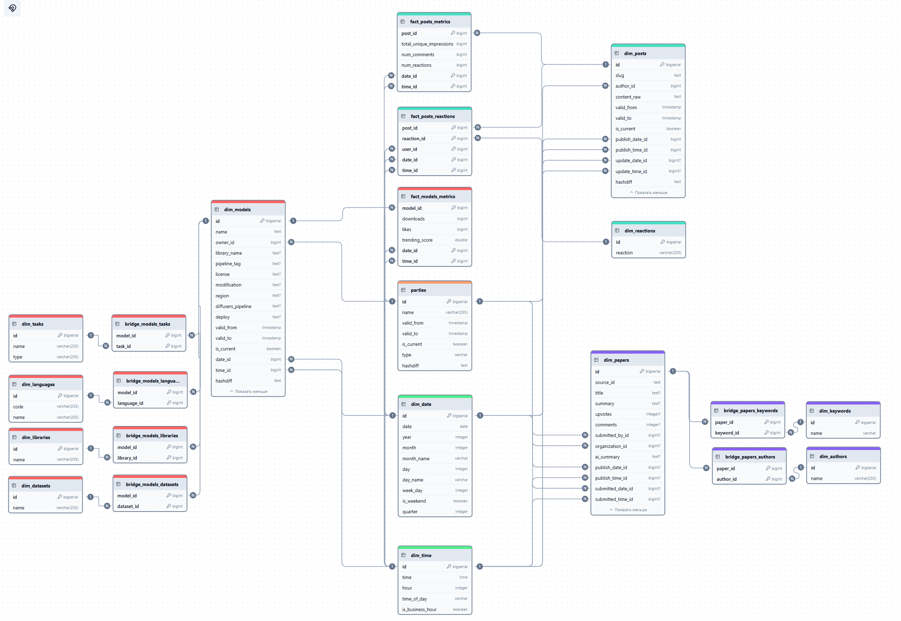
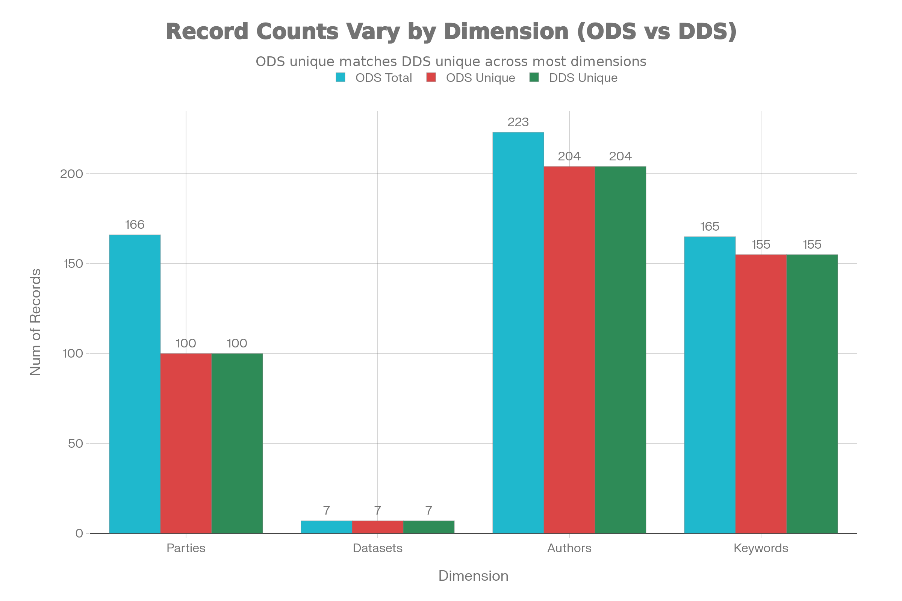
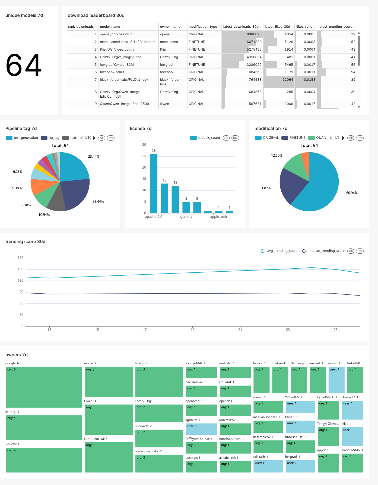

# BDST
Репозиторий для лабораторных работ по предмету "Технологии хранения больших данных"

источник данных: Huggingface.co

# Лабораторная работа №1 “Работа с Airflow. ETL-процесс.”: 
В рамках данной работы вам необходимо реализовать ETL процесс, отвечающий за сбор и загрузку сырых данных в хранилище (слой ODS). База данных должна быть выбрана командой, выбор необходимо аргументировать. Оркестрация ETL процессов должна быть реализована с помощью Apache Airflow (https://airflow.apache.org/). 
## Этапы выполнения:
- 1 Развернуть сервис Airflow в Docker-контейнере, используя docker-compose 
конфигурацию (примеры можно найти в официальной документации, 
https://airflow.apache.org/docs/apache-airflow/stable/howto/docker-compose/index.html); 
- 2 Выбрать 3 различных сервиса для хранения данных. Например: s3, mongodb, 
oracle. Добавить конфигурацию для развертывания хранилищ в docker-compose. 
- 3 Реализовать не менее 3 различных ETL процессов (DAGов). При нехватке 
данных на одной платформе, данные можно брать с нескольких. Например: ozon + wildberries, aviasales + tutu.ru; Данные можно разделять логически в рамках одного источника: комментарии, товары, отзывы. 
- 4 В результате работы ETL процессов данные должны быть выгружены в выбранные базы данных; 
- 5 Провести сравнительный анализ выбранных хранилищ данных. Сравнительные критерии необходимо выбрать самостоятельно. Выбрать наиболее подходящее хранилище для полученных данных. 

Для защиты необходимо предоставить отчет, описывающий этапы выполнения работы, а также исходный код ETL процессов и docker-compose файл. 

Обязательным условием является демонстрация работы: веб интерфейс Airflow, выгруженные данные в базах данных, сравнительный анализ в виде графиков и/или таблиц.

## Отчёт

### Подготовка окружения
Перед началом реализации ETL-процессов была выполнена подготовка окружения.

1. Создание репозитория и рабочей директории
2. Конфигурация Apache Airflow для Docker Compose была загружена из документации:
`https://airflow.apache.org/docs/apache-airflow/stable/howto/docker-compose/index.html"`
3. Создан кастомный dockerfile для установки дополнительных зависимостей.
4. В файл docker-compose.yml были добавлены три сервиса для реализации слоя ODS: `user-postgres`, `mongo`, `clickhouse` с соответствующими volumes: `user-pgdata:`, `mongodata:`, `clickhousedata:`.
5. Была успешно проверена работоспособность окружения.


### Реализация ETL-процессов
После изучения API huggingface были сформированы 3 ETL-процесса:
1. Сбор данных популярных моделей по параметру trending_score. 
2. Сбор данных статей из раздела daily papers.
3. Сбор данных постов из раздела community/posts за 1 день.

для получения данных использовалась библиотека huggingface_hub, а также bs4 для получения id статей.

#### DAG 1. models — сбор данных популярных моделей

- extract - вызов huggingface_hub.list_models(sort='trending_score', limit=50) для получения топ-50 трендовых моделей .

- transform - парсинг тегов в категории (language, library, task, license, base_models, modification, region, diffusers_pipeline, deploy, dataset, arxiv), извлечение owner из id, форматирование datetime, сбор метрик (downloads, likes, trending_score).

- load - одновременная загрузка в PostgreSQL, MongoDB и ClickHouse

    - PostgreSQL: таблица models_ods

    - MongoDB: коллекция models_ods

    - ClickHouse: таблица models_ods

эти данные позволят узнать параметры актуальных моделей и узнать статистику скачиваний и лайков.

#### DAG 2. daily_papers — сбор данных актуальных статей

- extract - парсинг https://huggingface.co/papers/date/{дата} через BeautifulSoup для извлечения arXiv ID (формат XXXX.XXXXX), последующий вызов huggingface_hub.paper_info() для полной информации.

- transform - извлечение ключевых полей (id, authors, title, summary, upvotes, published_at, submitted_by), форматирование datetime.

- load - одновременная загрузка в PostgreSQL, MongoDB и ClickHouse

    - PostgreSQL: таблица papers_ods

    - MongoDB: коллекция papers_ods

    - ClickHouse: таблица papers_ods

эти данные позволят изучить актуальные темы исследований,которые интересны пользователям.


#### DAG 3. posts — сбор данных постов за последний день

- extract - API-запросы https://huggingface.co/api/posts с пагинацией (skip=0,10,20...), фильтрация постов за последние 24 часа по publishedAt .

- transform - извлечение полей (slug, author_name/id, content_raw, published_at/updated_at, total_unique_impressions, num_comments), парсинг datetime в ISO.

- load - одновременная загрузка в PostgreSQL, MongoDB и ClickHouse

    - PostgreSQL: таблица posts_ods

    - MongoDB: коллекция posts_ods

    - ClickHouse: таблица posts_ods

эти данные позволят изучить активность людей на huggingface, а также темы, которые они обсуждают.

### Сравнительный анализ выбранных хранилищ данных

Для сравнения выбранных хранилищ данных был разработан тестовый DAG. Заранее были выгружены 10000 записей моделей. Каждая база данных тестировалась по 3-м параметрам: скорость записи и скорость исполнения запросов, обычных и с использованием join.

#### Результаты тестов

=== WRITE PERFORMANCE (10k records | 1k records | 100 records) ===
   - PostgreSQL : 2.387s | 0.276s | 0.049s
   - MongoDB    : 0.585s | 0.064s | 0.049s
   - ClickHouse : 0.119s | 0.025s | 0.018s

=== READ PERFORMANCE (queries 10k records | 1k records | 100 records) ===
- [POSTGRESQL]
  - avg_likes: 0.0152s | 0.0138s | 0.0119s
  - top10_downloads: 0.0018s | 0.0006s | 0.0006s
  - modification_stats: 0.0018s | 0.0007s | 0.0005s
- [CLICKHOUSE]
  - avg_likes: 0.0055s | 0.0050s | 0.1531s
  - top10_downloads: 0.0024s | 0.0026s | 0.0025s
  - modification_stats: 0.0043s | 0.0047s | 0.0051s
- [MONGODB]
  - avg_likes: 0.0045s | 0.0033s | 0.0032s
  - top10_downloads: 0.0046s | 0.0016s | 0.0020s
  - modification_stats: 0.0047s | 0.0016s | 0.0023s
=== READ PERFORMANCE (JOIN queries) ===
- [POSTGRESQL]
  - join_modification_stats: 0.0067s | 0.0040s | 0.0051s
- [CLICKHOUSE]
  - join_modification_stats: 0.0072s | 0.0070s | 0.0143s
- [MONGODB]
  - join_modification_stats: 0.2396s | 0.0231s | 0.0085s

#### Вывод по результатам анализа
`MongoDB` быстрая (запись 0.585s, чтение 0.0032s), но без схемы и foreign keys нормализация 3НФ невозможна. Медленные JOIN (0.2396s) усложнят витрины и дашборды с отношениями между таблицами.
`ClickHouse` доминирует в записи (0.119s для 10k), но не поддерживает ACID-транзакции и foreign keys, необходимые для нормализации 3NF и обеспечения референциальной целостности. 

`PostgreSQL` идеально подходит для нормализации до 3НФ — поддерживает foreign keys и транзакции для устранения транзитивных зависимостей в models_ods, papers_ods, posts_ods. Чтение стабильно быстрое (avg_likes 0.0119s, JOIN 0.0040s), что обеспечит дашборды и витрины данных без проблем. Медленная запись (2.387s для 10k) приемлема для реализованных ETL, так как данных не должно быть больше 1000.

#### Итоговое решение
Для дальнейшей работы будет использоваться PostgreSQL как основное хранилище. Оно обеспечит полную поддержку нормализации 3НФ для лабораторных а также стабильные JOIN для витрин данных и дашбордов.


# Лабораторная работа №2 “Работа с Airflow. ETL-процесс.”: 
Разработка базового аналитического хранилища данных на основе сырых 
данных из ЛР1. Формирование процессов очистки, трансформации и загрузки данных в 
слой DDS. 
## Этапы выполнения:
1. Определить структуру хранилища: схема "звезда" или "снежинка". Привести данные к 3НФ. 
    - Пример сущностей для DDS: 
      - Факты: продажи, комментарии, активность пользователей, 
      - Измерения: товары, пользователи, даты, категории; 
    - В некоторых источниках данных может возникнуть проблема с выбором 
    подходящей сущности для фактов. При возникновении такой ситуации 
    достаточно нормализовать данные. 
2. Создать новые DAG в Airflow для трансформации данных: 
    - DDS-слой: Скрипты очистки (удаление дубликатов, приведение типов), 
обогащение, агрегация; 
3. Где возможно, сущности должны соответствовать концепции медленно 
изменяющихся измерений (SCD), чтобы изменения значений атрибутов 
сущностей могли отслеживаться во времени; 
4. Построение зависимостей между ETL-процессами. Процессы детального слоя 
должны ожидать завершения соответствующих расчетов исходных данных. 
Для реализации зависимостей возможно использовать сенсоры 
(https://airflow.apache.org/docs/apache-airflow/stable/core-concepts/sensors.html). 
Альтернативные варианты приветствуются. 
5. Data Quality: реализовать DAG для проверки качества данных. 
    - Примеры возможных проверок: 
        - Сравнить объемы данных до/после трансформации, 
        - Проверить отсутствие аномальных значений в атрибутах.  
  - Для защиты необходимо предоставить отчет, описывающий этапы выполнения 
  работы, а также исходный код SQL скриптов и ETL процессов. 
  - Быть готовым продемонстрировать работу и веб интерфейс Airflow с 
  полученными ETL процессами, а также выгруженные данные в базе данных. 


## Отчёт

### Структура хранилища

Для построения аналитического слоя DDS была выбрана схема «Снежинка» по следующим причинам:
  1. В данных ODS большое количество полей представлено в виде массивов, и при использовании схемы «Звезда» они остались бы ненормализованными, что усложнило бы анализ и не позволило бы эффективно использовать связи между объектами. Схема «Снежинка» позволяет декомпозировать такие поля на отдельные таблицы и тем самым обеспечить структурированное и гибкое хранение данных.

  2. Некоторые измерения, такие как модели, статьи и посты, содержат вложенные атрибуты — дату создания, автора и другие характеристики, которые сами по себе образуют отдельные измерения. Это позволяет создать связи между измерениями времени, пользователей и тематических сущностей, что в дальнейшем обеспечит более глубокий и детализированный анализ данных.



### Преобразования

В рамках проектирования аналитического слоя DDS все атрибуты-массивы из ODS были нормализованы и вынесены в отдельные измерения; для моделирования их многозначных связей с основными сущностями используются bridge-таблицы. Это позволило избавиться от денормализованных структур и явно задать отношения «многие ко многим» между моделями, задачами, языками, датасетами, библиотеками и ключевыми словами.

Временные характеристики были выделены в отдельные измерения даты и времени, что обеспечивает необходимую степень детализации для аналитики: поддерживается разрез по кварталам, дням недели, рабочим/нерабочим часам и другим календарным атрибутам. Пользователи, встречающиеся во всех ODS-таблицах (владельцы моделей, авторы постов и статей, инициаторы реакций, организации), консолидированы в единое измерение с поддержкой SCD2, что устраняет дублирование и позволяет отслеживать изменения их атрибутов во времени.

Измерения моделей и постов также реализованы как медленно меняющиеся (SCD2), благодаря чему сохраняется история изменений ключевых свойств этих сущностей. Количественные показатели, которые подлежат анализу во временной динамике (метрики по моделям и постам, реакции и просмотры), вынесены в отдельные факт-таблицы, тогда как для статей ведение аналогичных фактов не предусмотрено исходной бизнес-логикой.

По итогу проделанных изменения данные соотвествуют 3НФ:

  - 1НФ: все атрибуты атомарны
  - 2НФ: устранены частичные зависимости
  - 3НФ: устранены транзитивные зависимости

### Реализация ETL-процессов

#### Заполнение постоянных измерений

- Измерение дат

  Таблица `dim_date` создается как календарное измерение и заполняется диапазоном дат с 2000 по 2030 год включительно, по одной записи на каждый календарный день. Для каждой строки дополнительно рассчитываются производные атрибуты (год, месяц, день, номер недели, квартал, день недели, признак выходного и т.п.), что обеспечивает гибкое агрегирование и фильтрацию по временным разрезам.

- Измерение времени

  Таблица `dim_time` формируется с часовым уровнем детализации и содержит 24 записи, по одной на каждый час суток. Для каждого часа могут храниться дополнительные признаки, такие как номер часа, часть суток или признак рабочего/нерабочего времени, что позволяет строить отчеты с почасовой детализацией.

- Справочники языков, задач, библиотек и реакций

  Таблицы `dim_languages`, `dim_tasks`, `dim_libraries` и `dim_reactions` относятся к статическим справочникам и заполняются из заранее подготовленных словарей. Такой подход обеспечивает единообразие кодов и наименований в аналитическом слое, упрощает сопровождение и предотвращает дублирование значений в других таблицах.

#### Заполнение динамических измерений и фактов

Все динамически изменяемые измерения и факты заполняются в рамках отдельных ETL-процессов для моделей, статей и постов, при этом каждая сущность обрабатывается независимо. В каждом из этих процессов из ODS-таблиц извлекаются данные о пользователях и организациях, после чего выполняется их запись и актуализация в общем измерении parties, используемом всеми измерениями.

- Заполнение измерений и bridge для моделей

  При обработке данных моделей из ODS из каждой записи извлекаются связанные датасеты, языки, библиотеки, задачи и пользователи, после чего соответствующие значения добавляются или актуализируются в своих измерениях. Параллельно формируются маппинги между моделями и этими сущностями, которые используются для последующей записи ссылок в dim_models (включая owner_id и другие внешние ключи). После загрузки всех необходимых данных заполняются bridge-таблицы связей моделей с датасетами, языками, библиотеками и задачами, а также создаются записи в fact_models_metrics, когда для моделей уже получены идентификаторы model_id.

- Заполнение измерений и bridge для статей

  При обработке статей из ODS для каждой записи извлекаются авторы и ключевые слова, которые загружаются в измерения dim_authors и dim_keywords либо актуализируются при изменениях. Далее строятся маппинги между статьями, авторами и ключевыми словами, на основании которых в таблице dim_papers дозаполняются внешние ключи и другие атрибуты. Завершающим шагом создаются записи в bridge-таблицах, фиксирующие связи статей с авторами и ключевыми словами, после того как для всех сущностей определены их идентификаторы.

- Заполнение измерений и фактов для постов

  При загрузке постов из ODS отдельно обрабатывается поле reactions, содержащее JSONB-структуру, из которой извлекаются типы реакций и участвующие пользователи. На основе этих данных создаются и обновляются записи в dim_reactions, а также формируются маппинги для связи постов с конкретными реакциями и пользователями. Далее заполняются таблицы fact_posts_reactions и fact_posts_metrics, в которых фиксируются количественные показатели по реакциям и метрикам постов в привязке к post_id и другим измерениям.

### Реализация SCD 2

В таблицах parties, dim_models и dim_posts реализован механизм медленно изменяющихся измерений типа 2 (SCD2), позволяющий хранить полную историю изменений записей. Для этого в структуру таблиц добавлены поля valid_from и valid_to, задающие период актуальности версии объекта, а также флаг is_current, упрощающий выбор текущей версии. Для действующих записей поле valid_to заполняется датой, отстоящей на 100 лет от момента добавления, что фактически моделирует «открытый» интервал актуальности.​

Определение необходимости создания новой версии выполняется с помощью поля hashdiff, представляющего собой хэш бизнес-атрибутов записи. В расчет hashdiff включаются, в том числе, атрибуты, связанные отношением «многие ко многим», поэтому любые изменения таких связей (например, добавление ключевого слова к статье или удаление датасета из модели) также приводят к закрытию старой версии и вставке новой строки. Такой подход обеспечивает консистентное ведение истории и позволяет анализировать данные в разрезе их состояния на любой момент времени.

### Связь между ETL-процессами

Для оркестрации загрузки DDS-слоя используется механизм триггеров дагов, позволяющий автоматически запускать обработку аналитических витрин сразу после завершения соответствующих ETL-процессов ODS. В каждый даг, отвечающий за загрузку данных в ODS, в конец пайплайна была добавлена отдельная задача, которая инициирует запуск связанного дага DDS и передает в него метку времени (timestamp), по которой определяются данные для инкрементальной обработки в аналитическом слое.

TriggerDagRunOperator - это оператор Airflow, который создаёт новый запуск другого дага и может передавать ему контекст, параметры и конфигурацию. Он выполняется как обычная задача внутри дага-инициатора и, в отличие от сенсоров, не удерживает слоты воркеров в ожидании события, а просто инициирует запуск целевого дага и завершает свою работу.

Преимущества по сравнению с сенсорами

По сравнению с сенсорами, которые постоянно опрашивают внешнее состояние (например, наличие файла или статуса дага) и тем самым держат задачу в режиме ожидания, триггер-оператор:

- Не блокирует слоты исполнения: задача отрабатывает быстро, после чего ресурсы освобождаются.

- Явно инициирует запуск зависимого дага и может передать ему сложную конфигурацию (включая timestamp и другие параметры инкрементальной загрузки).

- Упрощает логику: вместо длинно живущих сенсоров цепочка выполнения строится через прямую триггерную зависимость между ODS- и DDS-процессами.

### Качаство данных

В рамках контроля качества данных был реализован отдельный процесс, проверяющий корректность заполнения динамических измерений и степень сокращения объёма хранимой информации. В этом процессе выполняется сравнение количества записей по пользователям, датасетам, ключевым словам и авторам статей между исходными ODS-таблицами и соответствующими вспомогательными измерениями. Такое сопоставление позволяет убедиться, что при нормализации не теряются данные и не появляются «фантомные» записи, а также даёт наглядную оценку уменьшения дублирующей информации за счёт вынесения сущностей в отдельные справочники.

результаты:



График показывает, что во всех справочниках количество уникальных значений в DDS совпадает с числом уникальных значений в ODS, при этом общее число записей в ODS значительно выше за счёт дублирования. Это подтверждает корректность нормализации: данные не потерялись и не появились лишние сущности, а объём хранимой информации уменьшился за счёт вынесения повторяющихся объектов в отдельные справочники.

# Лабораторная работа №3 Построение витрин данных. Визуализация данных с помощью Superset.”: 
Цель данной лабораторной работы является построение витрин данных, а также 
визуализация полученных метрик с помощью Superset. Для успешного защиты 
необходимо сформировать витрины данных. Каждая витрина должна обеспечивать 
возможность 
получения 
конкретных 
аналитических 
выводов. 
Например, 
продемонстрировать наиболее популярные тематики, обсуждаемые пользователями 
форума, или пики пользовательской активности платформы.
## Этапы выполнения:
1. Развертывание сервиса Superset необходимо добавить в существующую 
конфигурацию docker-compose;  
2. Сформировать витрины данных на основе детального слоя данных.  
3. Реализовать скрипт формирования данных витрин и обернуть данный скрипт в 
ETL процесс. Аналогично связать данный процесс с ETL процессами 
детального слоя. 
4. На основе полученных данных сформировать дашборд из не менее 5 различных 
визуализаций. Аргументировать выбор визуализаций.
5. Сделать вывод на основе полученных данных и визуализаций.

Для защиты необходимо предоставить отчет, описывающий этапы выполнения 
работы, а также исходный код SQL скриптов и ETL процессов. 
Быть готовым продемонстрировать работу и веб интерфейс Airflow с 
полученными ETL процессами, визуализациями, а также выгруженные данные в базе 
данных.

## Отчёт

### Развертывание сервиса Superset
В существующем docker-compose окружении добавлены два новых сервиса: `superset-init` и `superset`. 

Сервис `superset-init` использует образ apache/superset:latest-dev и выполняет инициализацию: обновление БД (superset db upgrade), создание админа (superset fab create-admin) и финальную инициализацию ролей (superset init). Он монтирует локальный файл ./superset_config.py для кастомной конфигурации и зависит от здоровых postgres и redis из Airflow-стека.


Сервис `superset` (тоже apache/superset:latest-dev) запускается после успешного superset-init, экспонирует порт 8088, использует ту же ./superset_config.py и переиспользует существующие postgres (для метаданных) и redis (для кэша/очередей). Это минимизирует ресурсы.

### Построение витрин данных 

Для построения витрин данных были созданны необходимые таблицы, а также реализован граф models_ads, который использует `SQLExecuteQueryOperator` для заполнения этих таблиц, аггрегируя данные из dds слоя. Для связи с dds процессом использовался TriggerDagRunOperator.

пример формирования данных для витрины:

```
TRUNCATE ads.datamart_pipelinetag_pie;
    INSERT INTO ads.datamart_pipelinetag_pie
    SELECT COALESCE(dm.pipeline_tag, 'no_tag'),
           COUNT(DISTINCT u.model_id)
    FROM ads.datamart_unique_top7d u 
    JOIN dds.dim_models dm ON u.model_id = dm.id
    WHERE dm.is_current = true
    GROUP BY 1;
```
### Визуализация данных

| № | Тип визуализации | Датасет                        | Описание |
|---|-------------------|--------------------------------|----------|
| 1 | Treemap           | ads.datamart_owners_treemap   | Количество моделей у каждого пользователя, а также тип пользователя (user/org). |
| 2 | Pie chart         | ads.datamart_pipelinetag_pie  | Распределение моделей по тегам пайплайна за 7 дней. |
| 3 | Pie chart         | ads.datamart_modification_pie | Распределение моделей по типу модификации (ORIGINAL / FINETUNE и т.п.) за 7 дней. |
| 4 | Histogram         | ads.datamart_license_histogram| Количество моделей в разбивке по лицензии за 7 дней. |
| 5 | Line chart        | ads.datamart_trending_line    | Динамика среднего и медианного trending score, а также числа наблюдений по дням за последние 30 дней. |
| 6 | Big number        | ads.datamart_unique_top7d     | Количество уникальных моделей, попавших в выборку за последние 7 дней. |
| 7 | Table             | ads.datamart_leaderboard_30d  | Топ‑20 моделей по скачиваниям за 30 дней с владельцем, типом модификации, скачиваниями, лайками, like ratio и trending score. |



### Аналитические выводы

- На протяжении 7 дней наблюдается концентрация загрузок вокруг нескольких крупных владельцев (Google, Meta, Microsoft, OpenAI и др.), что указывает на доминирование больших организаций в актуальном топе моделей, при этом сохраняется заметная доля индивидуальных разработчиков.
- Распределение по pipeline tag показывает явное преобладание моделей для text-generation, но присутствует существенный хвост других задач (vision, multimodal и т.п.), что говорит о расширении спектра сценариев использования.
- Большая часть моделей в выборке использует открытые лицензии (Apache‑2.0, Gemma и др.), что упрощает их промышленное применение; доля моделей с закрытыми или нестандартными лицензиями относительно мала.
- По типу модификации доминируют ORIGINAL‑модели, однако FINETUNE и QUAN занимают заметную долю, отражая активную работу по адаптации и оптимизации базовых моделей под конкретные задачи и ресурсные ограничения.
- Тренд по среднему и медианному trending score за последние 30 дней демонстрирует умеренный рост или стабильность без резких скачков, что свидетельствует об устойчивом интересе к моделям без ярко выраженных краткосрочных всплесков.
- Разрыв между средним и медианным trending score указывает на наличие нескольких «супер‑популярных» моделей‑лидеров, которые значительно поднимают среднее значение по сравнению с типичной моделью.
- Big number (64 уникальные модели за 7 дней) показывает умеренный, контролируемый приток новых или актуализированных моделей, позволяя поддерживать актуальность витрины без перегрузки аналитики шумом.
- Табличный leaderboard по скачиваниям за 30 дней демонстрирует, что верхние позиции занимают крупные открытые модели от ведущих вендоров, но в топ‑20 заметно присутствие финетюн‑ и кастомных моделей, выигрывающих за счет специализированных сценариев и более высокого отношения лайков к скачиваниям.
